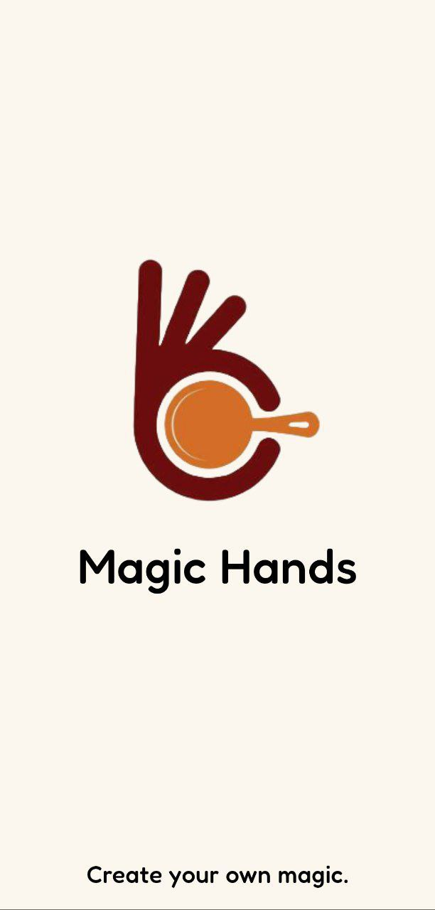
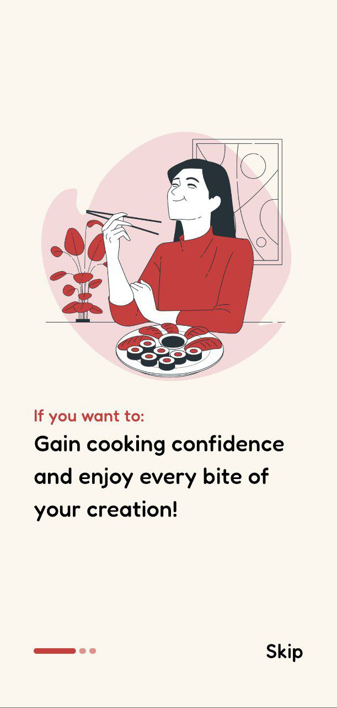
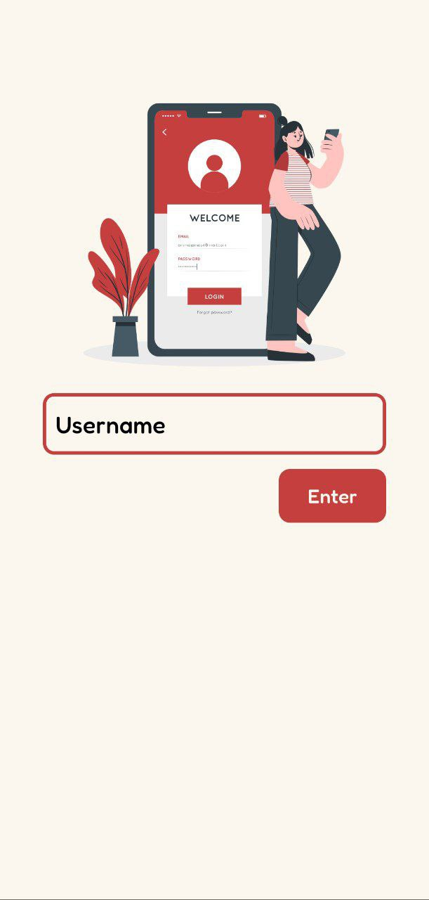
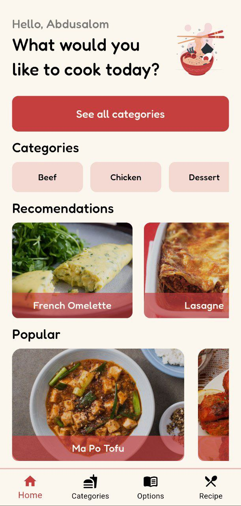
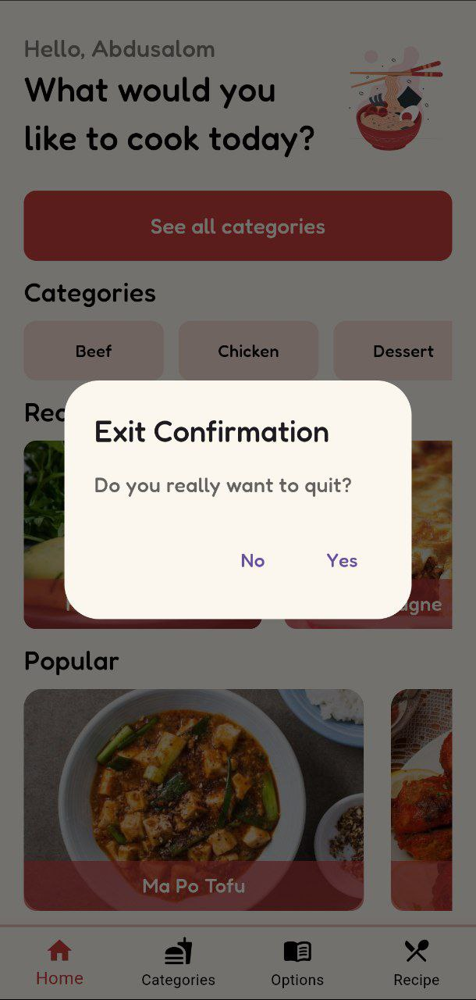
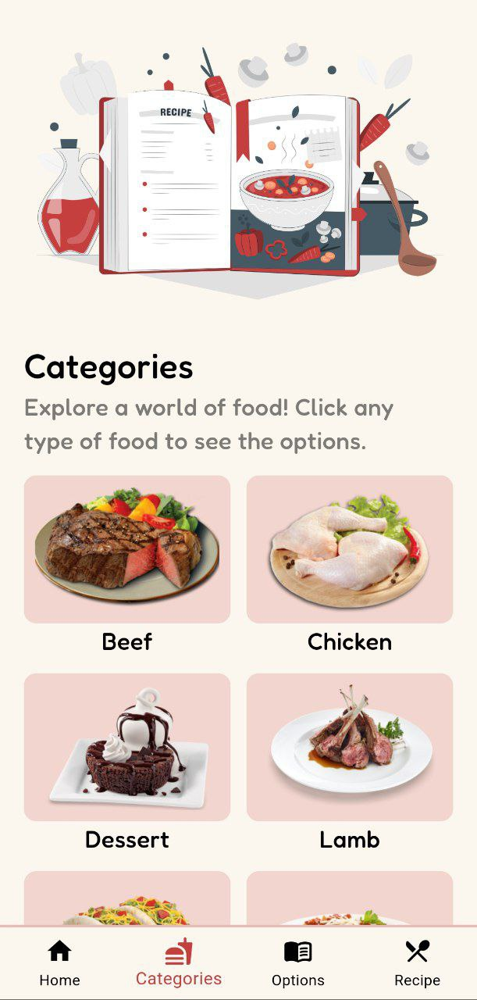
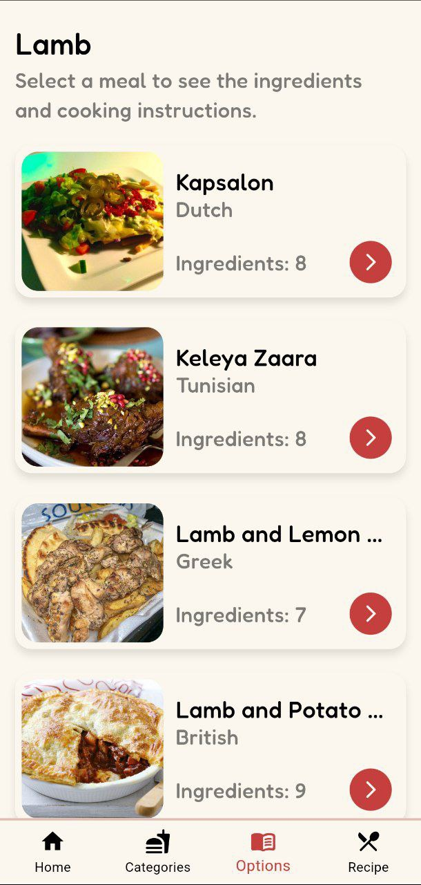
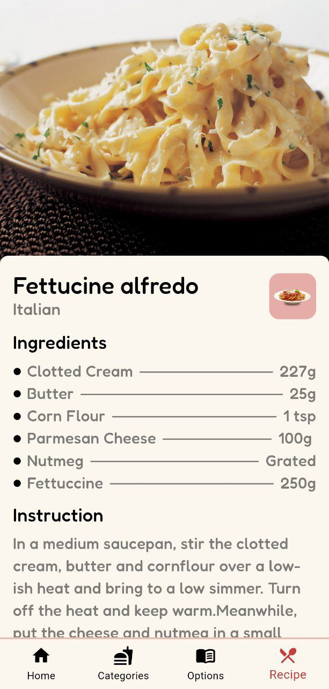
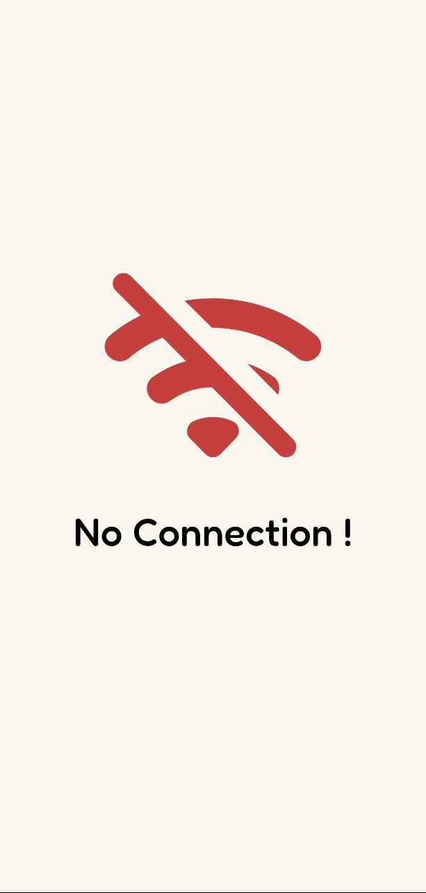

# Magic Hands

A simple Recipe application where users can learn how to make different type of meals and try it theirselves made by Abdusalom G'ayratov. In this application I used most of the important Widgets of the Flutter and I got public API from https://www.themealdb.com thanks for their great job. At the end thanks for all my teachers from Umar Adkhamov my first Flutter Mobile Developer teacher who helped me to learn basics of Dart and Flutter, Nasibali Abdiyev who was the teacher who tought me the Flutter and Dart with details, another staff from PDP Academy which is Diyorbek who supported me during my studies, Zikrulloh Akramov who is like brother to me and helped me in any cases during the development and at last but not least my friend Iftihor thanks you for encauraging me to learn Flutter and being on myside.

## Overview of the Application.

  
  
  
  
  
  
  
  
  

